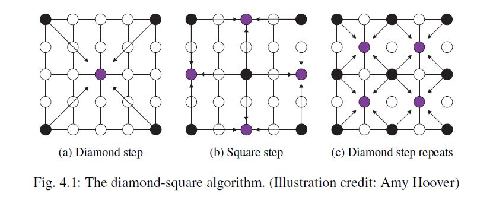

## PCG book notes

### 1. introduction

#### PCG定义

PCG中具体的定义，不包含AI玩家这种设计。具体涉及的方面也会在后面的章节中进行具体的展示

#### PCG好处

#### 使用了PCG的游戏

#### PCG一些前景

+ muti-level, multi-content generator
+ 以PCG为核心的游戏，没了的话游戏就能不能存在
+ PCG全自动生成游戏

#### 评估PCG的一些指标

+ 生成速度
+ 可靠性
+ 可控制性
+ 表达性和差异性
+ 创造性和真实性（believability）

#### PCG的分类

#### metaphors for PCG

+ PCG可以是游戏设计者的辅助工具
+ 能够自定义的材料，比如分形树
+ 领域专家系统

#### 本书框架

### 2. 基于搜索的PCG方法

#### 基于搜索的PCG核心

+ 算法
+ 内容表示的方式
+ 评估函数

#### evolutionary search algorithm

1. selection
2. reproduction phases

###### 其他搜索方法

+ 搜索空间小的话，那么可以使用穷举法
+ solver-based approach

#### 内容表示方式

基因型和表现型

选择合适的表示状态的方式，这样就能减小搜索的空间，从而能够加快搜索。

#### 评估函数

##### 直接评估函数

##### 基于模拟的评估函数

##### 交互式评估函数

#### 具体的例子

##### starcraft

...

### 3. 关于地牢和等级的构造方法

地牢和__等级(level?)__的含义说明。

#### 地牢生成的空间划分

2D：四叉树

3D：八叉树

地牢可以有两种四叉树生成：

第一种要确保每一个白色像素要联通。

第二种是先生成四叉树，然后不断的从下往上连接节点，叶子节点的房间的大小是随机生成的。

这两种方法的好处是，生成的地牢不会重叠。

#### agent-based dungeon growing

blind method: 有改变方向和增加一个房间两种可能事件。每次移动同一个方向，移动后改变方向的概率+5%，增加房间的概率+5%，一旦某个事件发生了，那么该事件概率一下子降到0%。

#### 元胞自动机

设置单元格的属性和变换的规则，不断的演变就能生成迷宫了。

当前格子的下一状态与此刻的状态和相邻单元格的状态有关。

#### grammar-based dungeon generation

(这一部分感觉不是很明白) chapter 5

#### advanced platform generation method

#### 应用

#### 总结

### 4. 分形，噪音和代理在生成地形中的应用

#### 地形图的生成

随机生成二维高度矩阵是不合理的，每一个地形点的高度和周围的高度有着密切的关系。

#### 插值

##### 二分插值

##### 三次函数插值

#### gradient-based random terrrain

将二维矩阵当作梯度的变化

#### 通过分形生成地图

#### agent-based

可控性较好，有多种agents有着不同的责任。没具体看其中的细节

#### generic terrain programming

### 5. 语法和L-system在植被和level中的应用

