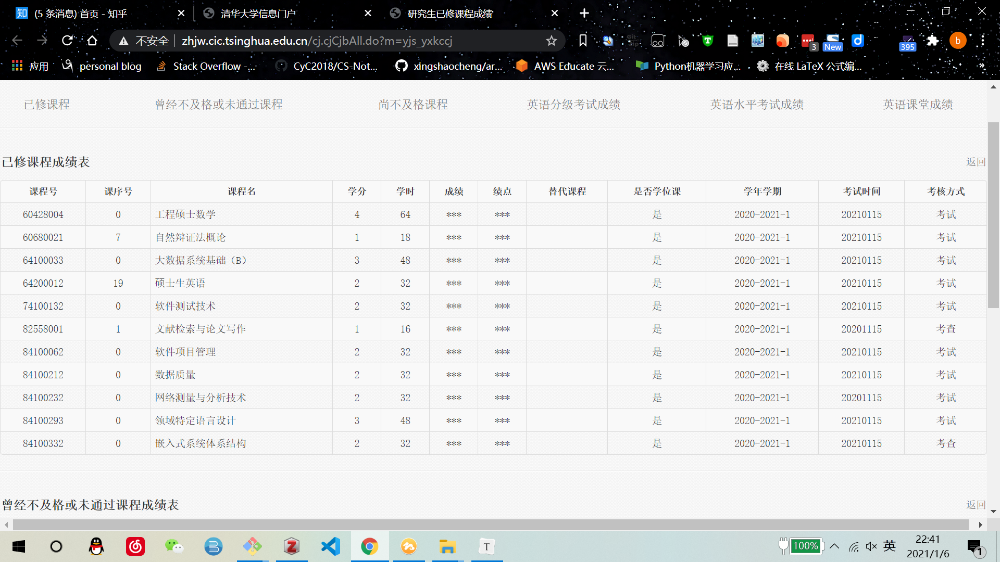

# 如何在研一上学期修完所有的课

实际上这是一个标题党，我当然没有在上学期修完所有的课程，因为有的课程必须在研一下学期进行，比如数据伦理和专业实践。

先直接上图，下图是本人选修的所有课程：

培养方案是：必修一门数学，一门外语，最少8门专业课和专业课17学分（两者要同时达到）。

然后从上面的截图可以看到，本人本学期修了数学+外语+7门专业课，也就是下学期还有一门专业课。至于为什么要留一门当然是因为要上龙明盛老师的《深度学习》了。那我为啥还使用了上面的那个标题呢？因为我还自修了一门操作系统的课程6.828，目前已经基本完工，并且完成了一份5W字左右的实验说明。寒假的时候还需要加一些虚拟化的实验，到时候再一并开源宣传一波。

同时，为啥我想一学期修完所有的课呢？因为下学期想做自己的事情啊，毕竟研究生的时间还是很宝贵的，个人的话是想修一波外语。同时研究生的大部分课程都很水，索性就一并学完吧。讲道理，如果对学分没有要求，我绝对会选择国外公开优秀课程。

写这篇文章既是个人的小小总结，同时希望能够帮助到有需要的同学。

## 选课

想要修尽量多的课，首先需要合理的进行抢课。大家若不是清本的同学，一定不知道抢课的策略，比如我在抢课的时候掉了五门课。。。当时想想简直是噩梦。

掉的课分别是：第一志愿英语、第二志愿自然辩证法、优先志愿：可视化、需求工程、数据质量。

后来英语在正选的时候选择了大家都不选的外教，一学期上下来还好，但是没有出成绩也不知道好不好。

自然辩证法在补选的时候选上了，上课的时间是后半学期。

数据质量后来李振华老师扩容了，又选上了。

其他若干专业课都用水课替代了。

给一个建议是不要硬着头皮用第一志愿去拼何福盛的英语课，因为放弃英语课的第一志愿，完全有更好的选择，而且用第一志愿也好像就30-40%的选中几率，就不要寄托于自己是天选之子了。

## 上课

### 数学

首先据说三门数学课中最简单的工程硕士数学，也就是数值分析。

整学期上下来，真的很难，陈俊清老师上课都不板书。。。但是一定要上课认真听，不会就自己翻书看。最后一星期密集复习成体系的时候，发现数值分析其实还挺简单的。（是真的）网课的话推荐[MOOC](https://www.icourse163.org/course/NEU-1002089009)上的网课，其实我本学期选的课实在是太多了，开学就有学长告诉我一定要听网课，但是我听了几次就没听了，因为一直听太枯燥了。这也是为什么学校强制大家一定要选一门数学课，要不然谁会选啊，太难了。

总而言之，就是上课认真听课，最后一星期密集复习，完全能搞定最后的期末考试。

### 英语

选的外交课，12次平时作业，每次大概1-2小时。若干个小的个人汇报，比如我们这学期就有两个汇报，最后考试是平时作业形式的听力考试，不是很难。如果第一志愿选了其他的，选外教感觉没啥问题。

专业课的话我分成水专业课和稍硬专业课。

___________________________

水专业课

### 领域特定语言

读一篇论文并讲，然后就没了，简直最大水课

### 数据质量

1-4人一个组，读两篇论文。水课。课虽水，李振华讲的一些观念还是比较有意思的，比如论文评分制度，如何反内卷，以及认为云游戏的不可行性，然后被腾讯成功打脸哈哈哈哈哈。

### 软件管理

若干小作业+考试，水课，就是小作业很烦

稍硬专业课

### 软件测试

四次大作业，每次都要上台汇报，最后两次课请阿里测试专家经验分享。

四次大作业分别是：

+ 单元测试
+ 网络学堂安全测试
+ 功能和性能测试
+ 基于数据驱动的测试

相对其他而言还是很硬的，不少同学第二次就退课了，慎选。

### 大数据系统基础B

刘老师钦点项目，没办法硬着头皮选了，熟悉了DWF的使用和开发，比较硬。。。难顶

### 网络测量

这个课是真的硬，但是当时我选的原因有二：

+ 我有网络测量的基础，且认识很深
+ 前八周就上完了，这样可以减少后面的课程压力

课程内容就是复现一片论文，甚至可以自己优化论文中的某一部分。

最后我选择的是网络拥塞控制算法Copa，反正没有网络基础的同学千万别选，基本上选的同学都在某一个网络领域有自己深刻的认识。

我中期的survey写了20页+，最后的实验部分写了7-8页。实验做了两个星期。。。这还是在我有很多基础之上进行的，好在个人感觉最后的成绩应该不错。

### 嵌入式系统

没有平时作业，最后大作业真是让人头秃，现在是2021.1.6晚，我依旧是一筹莫展。等我写完了大作业再更。

### 其他

其他若干必修我就不提了，没啥注意的。我还上课8周的贵系开的算法，后来顶不住就退了

## 小建议

研究生其实感觉就是锻炼强化自己自学的能力的，我这学期还在肝6.828，光写文档就写了我三个月左右，最后期末事情有点多被迫暂停。

## 更新

突然想起还有坑没填，上半学期的成绩不是很理想，不过我也不是很在意，毕竟研究生的主页不是上课嘛（自我安慰。

嵌入式系统最后的大作业没有做出来，导致得了最低分，所以没有硬件基础的话，不是很推荐这门课。

以及外教的英语课给分比较严格，自己得了个B 3.3。

自己得4.0的课程有：工程硕士数学、数据质量、网络测量。

