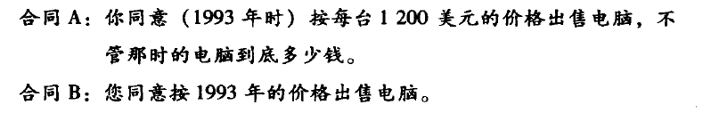
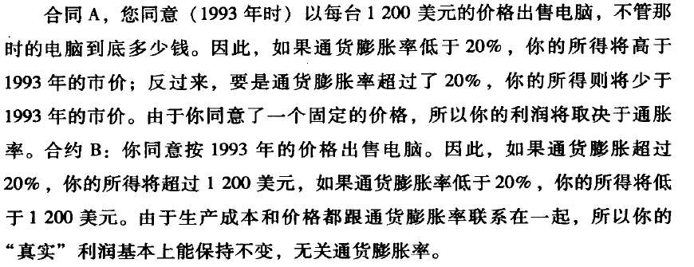
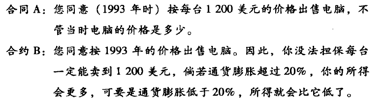

# 无价
本书重点：价格锚点，价格对比从而产生购买引导。

定价其实和成本没有关系，这完全是一场心理战。价格策略其实也是产品策略中的一个重头戏。

价格策略不仅仅是定价，而是什么价格是__陪衬价格__，什么价格是__主摊产品价格__。

价格中的心理学导向：“我来办好三件事情，您大约得准备这么多钱”和“您大约得准备这么多钱，我来办好三件事情”。

## 你不可不知的价格术语

+ 任意连贯性：该理论说，消费者其实并不知道什么东西该值多少钱。任意连贯性首先是一种相对理论。买家的敏感点是相对差异，而非绝对价格。（chapter 1）
+ 保留价格：对经济学家来说，指的是买家愿意支付的最高数额，或卖家愿意接受的最低数额。  

+ 兼容性原则：该规则说，决策者最注意的是跟所需答案最为兼容的信息。

+ 锚定：按照目前对“启动”的认识，文字和其他刺激激活了相关的精神过程。一旦“开关接通”，这一认知机制会保持一段时间的易感性，从而影响随后的思考和行动。“启动”在影响数值估算的时候，心理学家们就把它叫做“锚定”。
+ “非线性”定价：指价格不是一条直线，而是随着消费量变化。（72盎司牛排的例子）
+ 捆绑：指按看似便宜的价格同时销售若干项目的做法。

## 引言

天价麦当劳热咖啡赔偿案件，实际上说的是__价格锚点__的问题，先狮子大开口，然后据理力争，争取自己的合法的权益。

第二个例子就是有的商品是__缩量不缩价__，导致消费者能够接受这样微小的变化，而不会更换为其他的产品。一些产品下面的凹陷设计，就是经过这样的考虑设计而成的。

## 价格背后的心理奥秘

### 第1章 价格没头脑

行礼箱价格猜测，发现这样是不准的。

价格不过是拼凑出来的数字，不见得总是令人信服的。

比如我们知道张国荣的唱片是蔡依林的两倍，但是是卖10块钱还是1毛钱，这个无法决定的。我们只知道相对的价格，却很难知道绝对的价格。

非洲国家在联合国中的占比的例子，只有两个随机数字，10和65，但是平均的预期值是完全不一样的，主要的原因就是“锚定与调整”的现象。

### 第2章 黑就是白

本章重点：对比才能产生有趣的结论。

其中的一个实验：放一个人放入到一个特殊的环境中，并且让这个人事先不知道。

不断的增加这个特殊环境的摇晃的程度，知道受试者感觉到明显的异样。

实验表明，可察摇摆临界值比建筑工程师们的预计的要小10倍。

该实验的实践对象就是“世界贸易中心”，在911事件中有着不可或缺的作用。

确定物理强度与主观感觉的关联曲线。长久以来，人们就知道这不会是一条直线。

这一章强调的就是价格的相对性。

### 第3章 价格效用：谁在决定价格

关于左轮手枪买子弹的问题：开始子弹填满，你会花大价钱去买里面的一颗子弹；如果里面有4颗子弹，你可能会抱有较大的赌运气的成分；如果里面只有一颗子弹，你也会花大价钱去买里面的一颗子弹，确保自己是100%安全的。

结论：100%肯定的事情和可能性为99%的事情，在主观上有着巨大的差异，这种差异表现在价格和选择上。与此同时，10%和11%的概率差异就可以忽略不计了。

阿莱悖论测试：

实验一：

(a)稳拿100万美元

(b)89%拿100万美元，10%250万美元，1%什么都没有

倾向于选择(a)

实验二：

(a)11%获得100万美元。

(b)10%获得250万美元。

倾向于选择(b)

实验三：

(a) 89%获得盒子里的东西，11%获得100万美元

(b)89%获得盒子里的东西，10%获得250美元，1%啥都得不到。

理性思维有一个公理就是忽略相同的因素，比如本实验中的盒子里面到底装了什么。如果盒子里装的是100万，那么和实验一的内容一致；如果盒子里面啥都没装，那么和实验二一致，也就是说，这三个实验实际上是完全一样的，但是我们最后的选择却是不一样的，实际上就是一种不理性的表现。

> 我们是在选择的描述之间进行选择，而不是单纯地在选项之间作选择。

### 第4章 偏好逆转：为什么喜欢A却给它的定价低

赌博可以分成两种部分：第一种是大概率的低收益的回报；第二种是小概率高收益的回报。

现实实验表明人们更喜欢第一种赌博的方式。这里面考虑一个问题，就是小概率高收益中的收益究竟有多高？最为理性的方式肯定是求期望，然后两种选择的期望是相等的。

但是实际上人们虽然偏向于选择大概率低收益的回报，但是实际上却给小概率高收益的回报一个很高的价格。使得后者的期望大于前者的期望。

天下没有免费的午餐解读：

+ 在原有的基础之上，使得原来的价格变高了。实际上花的钱并没哟变少。
+ 免费的东西在消费者眼中变得不再值钱，使得不能发挥其原来的作用。

### 第5章 锚定效应：随锚点上下浮动的价格

背景锚点：一些无关紧要的数字，就能让人进行联想，进行若干的关联和推断。

还有奇怪的高价联想效应：一个剧场根据不同的位置划分区域，然后进行阶梯收费。然后发现做高价的地方领先被卖完。

好莱坞露天剧场的一美元门票基本上无人问津。虽然离舞台最远，但是观赏体验基本上是差不多的。而且亿美元的座位欣赏日落和城市景观效果也更好。

高价麦当劳咖啡的赔偿也和该原理有非常紧密的联系。

### 第6章 记忆价格和前景理论：我们对价格很愚钝

一些固有的印象让我们对一些商品的价格进行了估计，而不是产品本身的价值。

但是实际上这样的想法本身也没有错啊，毕竟我们也不知道一个商品本身的价值是多少，所以这样的对比和联想是没有任何问题的。

前景理论：[前景理论的应用-知乎](https://www.zhihu.com/question/33525083)

### 第7章 最后通牒博弈：讨价还价中的心理状态

两人的博弈，博弈内容：两人分奖金，一人提议，一人表示是否同意。一旦不同意两人则没有任何的收益。

这个博弈中有诸多的因素，如参与博弈的人群，是男人，男女之间，雄性激素水平等等因素。

可以通过这个博弈，来测试不同人群的性情。大部分的参与者会选择五五开，还有的群体响应者会接受提议者较低钱财的提议。

### 第8章 一掷千金：丰厚的奖金是否影响判断

最后通牒的升级版，当两人同时分1000万美元的时候，提议者提议自己分900万，响应者得100万，这个时候由于理性的原因，响应者肯定是会同意的。

## 第二部分 魔术般的价格骗局

### 第9章 免费的72盎司牛排

不论是牛排定价策略，还是手机费用套餐，它们怂恿消费者对低价展开荒谬的追求，让他们付出超乎本意的价钱。

许多人觉得是顾客上当了。新的心理学反驳说，“客户想要什么”并不是一种特别明确的东西。它是在现场构建的，许多在意识思维看来无关紧要的细节都可以对其产生影响。

### 第10章 价格吸引的诱饵

完全一样的商品，在不同地方买，心里的预期价格是不一样的。

建议：投资一些表面上看似多余的豪华设施，或是增设一间酒吧。这将提高人们对商品恰当价格的心理预期，进而带来更多的销量。

为了提高廉价品牌A的市场分额，你只需要提供一种更便宜的选项C。C成了“诱饵”，它本身可能不会得到太多的市场份额，但是它会产生一种吸引效应，把消费者转移到原先的廉价品牌A上。

### 第11章 普拉达的“托儿”

锚点本身也供出售——但要是没人买它，没关系，它摆在那儿就是用来作对比的。跟它一比，其他所有东西就都显得买得起了。

奢侈品的价格和任何成本都没有直接的关系。

奢侈品定价的艺术，就是要量化产品对消费者的价值，不考虑成本、竞争对手或者市场价。

### 第12章 菜单标价心理战

 菜单上经常出现捆绑的现象。等回头客对熟悉套餐的价格熟稔之后，捆绑效应也随之减退。出于这个原因，连锁餐厅的菜单总是不停地变化。

操纵性菜单设计往往还要借助排版的力量。比如菜单上是否有省略号，省略号的作用实际上是一种查看价格引导的作用。

菜单上的图片也能增加消费者的食欲和选择。

还有在菜单上增加诱饵菜，使得消费者看到这个菜更便宜，选择该菜的意愿会更大的。

### 第13章 超级碗门票的价格

### 第14章 电视购物全是套装而且还有赠品

本质上前面的价格都是铺垫，最后才是这些广告希望消费者购买的商品，具由很高的诱导性，需要进行避让。防止进入消费陷阱。

### 第15章 移动电话资费套餐的秘密

心理定价中最有力的一种工具是统一费率偏爱。消费者喜欢统一的费率，哪怕他们会出更多的钱。

中午的食物是飞机票中的一个服务之一，但是羊毛最终还是出现在羊身上的。但是消费者们还是会感觉到比较的舒服的，愿意多花这些钱，他们感觉这些是免费的。

比如有的美国人宁愿自己买车，也不愿意每天打车，不想看几十美元的打车费；

Netflix提供的月租赁活动，不是按照租赁的次数进行计费的。

实际上就是对很多的服务进行打包统一定价，这样实际上能够促进消费者的消费意愿。

### 第16章 折扣券的秘密

第一个陷阱：

人们更倾向于用200美元买一台打印机，得到25美元的折扣券；而不是直接买标价175美元的同款打印机。

用一句俗语“天下没有免费的午餐”来解释折扣券是再合适不过了。每一种提供折扣券的商品，都会因为要打折而卖得更贵一些。

### 第17章 浮云般的定价

本章讲的是商品的价格实际上和功效并不一定是正比的，陈述了一些商品的事实。比如电话短信网络的使用，不论有没有消费者，它始终是存在那里的，并且为消费者使用。消费者越多赚的越多，成本一定。

### 第18章 你真的相信偏移和更便宜吗

### 第19章 神奇数字9

一个比整数稍低的价格，叫做“魔力数字”。这通常意味着价格以9或者99姐喂，但98和95同样被看成是魔力价格。

有研究通过实验表明，较之相邻的整数价，魔力价格平均提高了24%的销售量。

另一种理论认为，魔力价格传递出“价格已经打过折了”的信息。

### 第20章 分不清的免费和低价

实验：两种巧克力，一种是1分钱的巧克力，另外一种是1毛五的巧克力。标牌上写的是：每位顾客限一块。大多数的人选择了一毛五的巧克力。

这次第一种巧克力免费，第二种巧克力价格为一毛四，但是大多数的人选择了免费的巧克力。

这主要是确定性效应造成的。只要是买东西，买家都要承受后悔的风险。

若是想让他人做出这个选择，要__有意识的进行引导__。首先说某件事是需要代价的，然后说这件事是免费的。选择的人会更多。

例子：一个演讲，一开始说如果去了给你钱，之后变成不给钱你去，这样最后选择去的人非常的少；如果变成一开始要钱，然后说演讲是免费的，那么去的人会变多。

实际上两者最后都是免费，但是由于引导的方向不同，导致最后选择参与的人也不同。

### 第21章 房价一定要定得比市值高

挂牌价高固然好，可是找买家的时间也长，这方面的成本自然相对较高。

因此定价也不能高于市值过多。

### 第22章 卖了安迪·沃霍尔的海边别墅

该别墅一开始专家给出的价格是2500万，但是卖家挂到了5000万美元，然后不断的降价销售，最后花花了7年的时间以2750万成交。

倒卖房子的人有个惯用的手法，先在短期内把房子挂一个非常高的价格，然后在卖家和经纪人的耐心容忍范围内，把它降到合理的水平。

## 第三部分 挥舞价格的魔棒

### 第23章 抢先出你的价

先报出数字的人所确立的锚点是最有力的。

### 第24章 让对手注意力不集中

在一般的讨价还价的例子中，假设博弈双方需要商榷的价值为10$，第一个人进行提议，第二个人表示是否接受，如果接受那么按照第一个人提议中的方案分配。否则两个人没有任何的收获。

若博弈双方完全理性，那么第一个人不论提出什么样的分配方案，那么第二个人都应该是同意的。

但是在现实生活中，人们往往是非理性的，那么当第二个人觉的不公平的时候，就会选择拒绝（奇怪的“公平”心理在作祟）。

-----------

但是游戏规则稍微改变一下，第一个人只给第二个人两者选择，要么选择两美元，要么选择3美元。这个时候大多数人都是同意的。

（有时候进行一定的比较，往某个地方进行引导，会有不错的效果。比如上面就是，就是引导第二个人你最好拿3美元，否则将将一块钱都没有没有）

------

实验表明，第二个人在第一个博弈中平均的收益为4$，而在第二个博弈中的收益大约是2.33美元。__可见对价格引导的重要性。__

> 一开始出高价，然后故作思考。之后出一个对买者有利的价格，买者很快就会答应了。其实，新出价是谈判者早就盘算好的——要不这么做，对方是断断不会接受的。

所谓的公平也有黑暗的另一半。在孤立评价结果的时候，人们更注重人际比较，而不是最大化个人所得的结果。并且一般的人做选择的时候都是有先后顺序关系的，而不是一下子就能够得到所有的选择结果，这一点是值得我们好好思考的。

### 第25章 喝喝小酒，好做生意

赌场里的免费酒精就是对人们的一种刺激的行为，使得他们爱冒险和大胆。

这里举的例子是关于两种选择的例子：

第一个：

1. 50%概率获得10美元，50%损失10美元
2. 66%获得10美元，否则损失80美元

第二个：

1. 50%概率获得10美元，10%损失10美元
2. 66%获得80美元，否则损失10美元

酒精把人们本来就有限的注意范围进一步缩小了，人们给这种现象取了个绰号，叫“酒精近视”。

### 第26章 通货膨胀背景下的货币错觉

> 金钱只是获得东西的一种工具。价格稳定的时候，我们可以把金钱和购买力画上等号。但是货币的购买力不断的变化，就有必要对两者加以区分。

很多时候，我们的社会就是 一条巴普洛夫实验里用的小狗，金钱就是唤起它反应的小铃铛。当多次的重复之后，我们学会了对着空洞的符号猛流口水，__反倒把真正的肉骨头抛到了脑后。__

通胀的措辞也非常的重要。

版本一：

54%选择B

版本二：

81%选择B

版本三：

59%选择B

__营销专家随时都在利用通胀的力量。__

比如杂志订阅原价149，后来打折119。之后原价涨价，但是给老顾客的是原价。再后面原价、老顾客都提价，这样就既能够挽留住老顾客，还能提高价格。

### 第28章 利用性别差异的最后通牒博弈

通过实验证明了女性在当时社会的弱势地位。

离婚案中的最后通牒博弈，男性有着更强的赚钱能力，女性表示是否接受，从而决定最后资产的分配。

实际上女性最好的方式就是__拒绝不公平出价__。

### 第29章 漂亮的人薪资更高

实验：

首先对一些人进行外貌的打分，然后进行最后通牒的博弈。提议者在之前会看到响应者的照片。实验结果表明，漂亮的人会比一般的人收益要高。

### 第30章 巧妙利用“傻瓜蛋理论”

通过卖车实验，发现黑人和女人的价格要比白人男性要高。

实验中，经销商经常是让跟志愿者性别、种族相同的推销员接待他们，“可接下来这些推销员却给了他们最糟糕的交易”。__实际上黑人从白人推销员手里得到的交易更优惠，女性从男性手里得到的交易更优惠。__（真的是让人有点出乎意料啊）

PS：但是不能得出男性应该从女性手上买车这样的事实啊，因为通过下面的一章可以看出来，女性使得男性会冲动消费，使男人更愿意花钱，哪怕是素不相识的人。

还有一个发现：那些声称自己驾驶过该汽车的志愿者比没有的志愿者少支出319美元。

原因：经销商听买家这么说了以后会急于完成交易。所以能够做出更多的妥协。

### 第31章 利用性别差异定价

实验：

给用户发送贷款邮件，其中包含一个人物的头像，这个人物的头像是变化的，比如人种，性别。

一部分人收到的是异性的照片，还有一部分人收到的是同性的照片。

结果表明，性别是有关系的，种族却不要紧。性别效应在男性身上体现，在给定利率的情况下，要是信件里有女性的照片，那么男性客户会更容易接受贷款。对于女性客户来讲，就没有这样的影响。

### 第32章 全是睾丸酮和催产素惹的祸

也许最后通牒博弈中的金钱并不重要，当两名男性进行的时候，__往往就是为了比其他雄性做的更好__。因此有一方提出不合理的分配的时候，拒绝双方什么都得不到往往是最好的选择。

戴了结婚戒指，无名指比食指短的男性，往往睾丸酮比较的低。

还有销售员主动向客户喷催产素的，从而影响客户的决策。

### 第33章 百万美元俱乐部

话题：那些大公司的CEO是怎么确定工资的？

### 第34章 淘气的市场先生

关于股票市场的讨论。

市场的波动的原因，股票上涨的原因是因为股票的数量一定，但是随着注入市场的钱越来越多，股票的价格也随之增加。

### 第35章 看在上帝份儿上

关于天价奢侈品的买卖的讨论，关于镶嵌满钻石的头骨的制作，转售的过程。

实际上这些东西买卖的意义就是增加自己的曝光度，从而达到某个目的。

### 第36章 锚定解毒剂

“反向思考”能影响决定直观和本能一面。它可以减少锚点对价格的效力。

这其实在我们平时讨价还价的时候有很大的作用，比如说我的车很便宜，给我便宜点修吧。等等例子。

### 第37章 带上你的好朋友

多大的群体能够左右孤独的受试者，答案是三个人就可以。

只要受试者就会收到其他人言论的影响，很容易被他人的言论所左右。

如果去汽车专卖店，带上一个朋友，这个朋友就能够起到锚定解毒剂的作用。如果带上两个人，那就能达到三人成虎的神奇门槛，对自己的定价是更有利的。

### 第38章 义愤理论

怎么将问题的严重程度转换成具体的金钱的数量，这是一个值得深思的问题。确定将公众的惩处意图换算成具体金钱的数量，通过实践得出的转换功能就可以用来确定损失赔偿费用。

### 第39章 环境影响判断

不同实验者在逛网络商城的时候，会看到不同的背景图片，发现背景图片会对人的决策产生影响。这也就是为什么淘宝要把自己的销售界面做的花里胡哨的，尝试着吸引顾客的购买。

还有就是自助咖啡售卖，消费者自觉的投放钞票（独裁者博弈），发现放眼睛的实验组放的钱数是鲜花的2.6倍。

### 第40章 金钱，巧克力，幸福

巧克力实验：

(a)组人选择写一件自己很失败的事情，并且吃15g的巧克力。

(b)组人选择写一件自己成功的事情，并且吃5g的巧克力。

两组人吃完巧克力之后，写下1-9内心的快乐程度，结果表明(b)组的同学要更快乐一些。

可以将生活中的金钱比作实验中的巧克力。

在现实当中，金钱是苦乐参半的巧克力。我们穷尽一生来寻找最低的价格，最高的薪水，最多的金钱——用这些数字来确定自己的幸福。