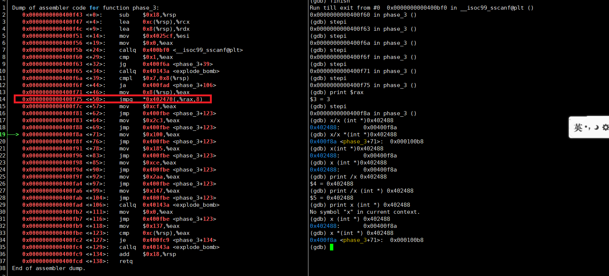

## CSAPP实验


### bomb lab



实验中有这样一个语句：

```asm
14x    0x0000000000400f75 <+50>:    jmpq   *0x402470(,%rax,8) 
```

此刻`%rax`里面保存的值为3，则0x402470+3*8=0x402488，`\*`表示取该地址里面的值，debug时可以用`x (int *) 0x402488`查看。

发现是`0x00400f8a`，那么`jmpq`命令就会跳转到这个地方。

